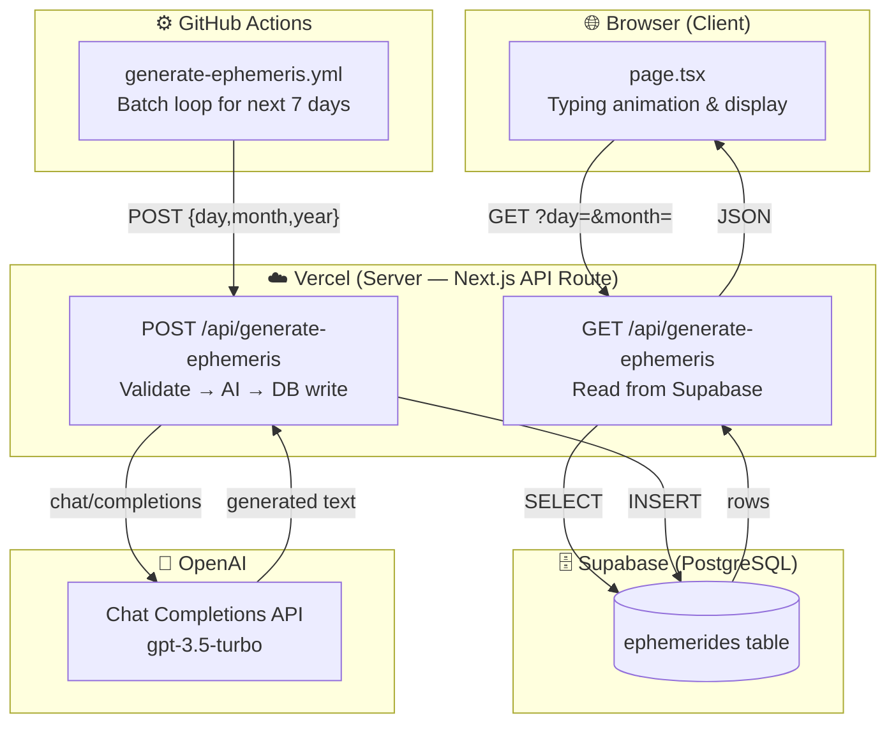
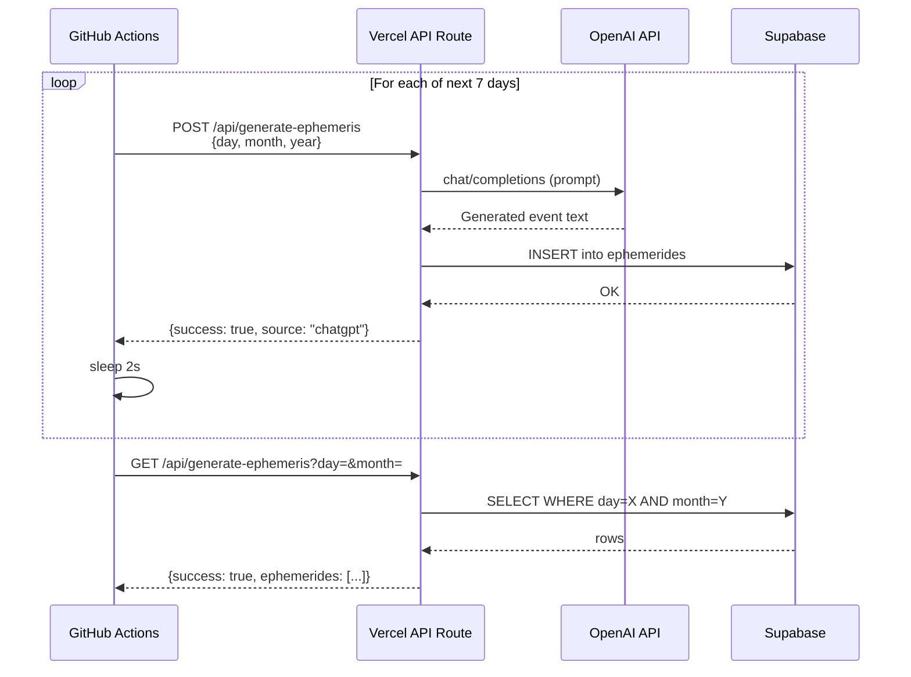

# Programming Ephemerides

[](https://github.com/lenz-moraga/programming-ephemerides/actions/workflows/ci.yml)
[](https://programming-ephemerides.vercel.app/)
[](LICENSE)

> A terminal-styled web app that surfaces a historically significant programming event for every day of the year, generated by AI and stored in a Supabase database.

**Live demo:** [https://programming-ephemerides.vercel.app/](https://programming-ephemerides.vercel.app/)

<!-- Replace this comment with an actual GIF once captured: docs/images/demo.gif -->
<!--  -->

> 📸 **Screenshots / GIF instructions:** see [`docs/images/README.md`](docs/images/README.md) for how to capture and add visuals.

---

## Overview

Each day, users can discover a historical milestone from computer science history — from the creation of programming languages to landmark software releases. Content is generated once by a GitHub Actions batch job (calling the OpenAI API) and then served instantly from Supabase on every page load.

---

## Features

- 🖥️ **Terminal / hacker aesthetic** — animated typing effect, floating gradient backgrounds
- 🤖 **AI-generated content** — GPT-3.5-turbo writes historically accurate ephemerides in Spanish
- 📅 **Daily discovery** — one entry per calendar day, pre-generated for the current week
- ☁️ **Serverless architecture** — Next.js API routes on Vercel + Supabase PostgreSQL
- 🔄 **Automated batch generation** — GitHub Actions POSTs to the production API on a schedule
- 🧪 **Tested** — unit and API-route tests run in CI on every PR

---

## Tech Stack

| Layer | Technology |
|-------|-----------|
| Framework | Next.js 15 (App Router) |
| Language | TypeScript 5 |
| Styling | Tailwind CSS + Radix UI |
| Database | Supabase (PostgreSQL) |
| AI | OpenAI `gpt-3.5-turbo` |
| Deployment | Vercel |
| CI / Automation | GitHub Actions |
| Tests | Vitest |
| Package manager | npm / pnpm |

---

## Architecture



---

## Generation Flow



---

## What Runs Where

| Responsibility | Client (Browser) | Server (Vercel API Route) | GitHub Actions |
|---|---|---|---|
| Render the terminal UI | ✅ | | |
| Fetch today's ephemeris | ✅ (GET request) | | |
| Validate request params | | ✅ | |
| Call OpenAI API | | ✅ (secret stays server-side) | |
| Write to Supabase | | ✅ | |
| Read from Supabase | | ✅ | |
| Trigger batch generation | | | ✅ (POSTs to prod API) |
| Hold `OPENAI_API_KEY` | ❌ never | ✅ (env var) | ✅ (secret) |
| Hold Supabase anon key | ✅ (public by design, RLS-protected) | ✅ | ✅ |

---

## GitHub Actions Workflow — `generate-ephemeris.yml`

**File:** [`.github/workflows/generate-ephemeris.yml`](.github/workflows/generate-ephemeris.yml)

**Triggers:**
- Push to `main` that touches `app/api/generate-ephemeris/**` or the workflow file itself.
- (Commented out) weekly `schedule` cron and `workflow_dispatch` for manual runs.

**What it does:**
1. Checks out the repo and installs Node.js dependencies.
2. Loops over the **next 7 days** and POSTs `{ day, month, year }` to the live Vercel endpoint.
3. Waits 2 seconds between requests to avoid OpenAI rate limits.
4. GETs today's entry to verify the response is valid JSON.
5. Prints a success / failure summary (always runs, even on failure).

**Secrets required in GitHub repository settings:**

| Secret | Purpose |
|--------|---------|
| `NEXT_PUBLIC_SUPABASE_URL` | Database URL passed to the Vercel API |
| `NEXT_PUBLIC_SUPABASE_ANON_KEY` | Supabase auth for inserts |
| `OPENAI_API_KEY` | Authorises ChatGPT calls inside the API route |

---

## Setup / Quickstart

### 1. Clone & install

```sh
git clone https://github.com/lenz-moraga/programming-ephemerides.git
cd programming-ephemerides
npm install        # or: pnpm install
```

### 2. Configure environment variables

```sh
cp .env.example .env.local
# Edit .env.local with your Supabase credentials
```

See [`.env.example`](.env.example) for all required variables and their descriptions.

### 3. Create the Supabase table

```sql
CREATE TABLE ephemerides (
  id           bigint  PRIMARY KEY GENERATED ALWAYS AS IDENTITY,
  day          integer NOT NULL,
  month        integer NOT NULL,
  year         integer NOT NULL,
  event        text    NOT NULL,
  display_date date
);

-- Row Level Security
ALTER TABLE ephemerides ENABLE ROW LEVEL SECURITY;

CREATE POLICY "Allow public select" ON ephemerides FOR SELECT USING (true);
-- For development only — restrict inserts in production:
CREATE POLICY "Allow public insert" ON ephemerides FOR INSERT WITH CHECK (true);
```

### 4. Run locally

```sh
npm run dev
# Open http://localhost:3000
```

In development, the API route uses local fallback data (`lib/ephemeris-data.ts`) instead of calling OpenAI, so no API key is needed.

### 5. Seed data (optional)

```sh
npx tsx scripts/add-today-ephemeris.ts          # Add today's entry
npx tsx scripts/generate-week-ephemeris.ts      # Add next 7 days
npx tsx scripts/test-api.ts                     # Smoke-test the API
```

---

## Environment Variables

| Variable | Required | Description |
|----------|----------|-------------|
| `NEXT_PUBLIC_SUPABASE_URL` | ✅ Always | Your Supabase project URL |
| `NEXT_PUBLIC_SUPABASE_ANON_KEY` | ✅ Always | Supabase anon/public key (safe to expose, protected by RLS) |
| `OPENAI_API_KEY` | ✅ Production / CI only | Secret key for OpenAI API calls |

> ⚠️ **Never commit real credentials.** Copy `.env.example` to `.env.local` and fill it in locally. GitHub Actions reads these from encrypted repository secrets.

---

## Tests

```sh
npm run test          # Run tests once
npm run test:watch    # Watch mode
npm run test:ci       # Verbose output (used in CI)
```

Tests live in `__tests__/` and cover:

- **`ephemeris-utils.test.ts`** — pure utility functions (`formatDisplayDate`, `isValidDayMonth`, `buildEphemerisPrompt`, `buildGenerationPayload`)
- **`generate-ephemeris-route.test.ts`** — POST/GET API route behavior with Supabase and OpenAI calls fully mocked

---

## Deployment

1. Push to GitHub; Vercel will automatically build and deploy `main`.
2. Set the three environment variables in your **Vercel project settings → Environment Variables**.
3. Add the same three values as **GitHub repository secrets** (Settings → Secrets and variables → Actions) to enable the generation workflow.

---

## Troubleshooting

| Symptom | Likely cause | Fix |
|---------|-------------|-----|
| Blank page / "No ephemeris found" | Supabase table empty | Run the seed scripts or trigger the GitHub Actions workflow |
| 500 on POST in production | Missing `OPENAI_API_KEY` env var on Vercel | Add the secret in Vercel project settings |
| GitHub Actions workflow never runs | Push did not touch the path-filtered files | Edit `app/api/generate-ephemeris/**` or uncomment `workflow_dispatch` |
| Tests fail locally | Wrong Node version | Use Node 20 (`nvm use 20`) |

---

## Project Structure

```
.
├── app/
│   ├── api/generate-ephemeris/route.ts   # POST (generate) & GET (retrieve)
│   ├── layout.tsx                        # Root layout + fonts
│   └── page.tsx                          # Terminal UI (client component)
├── lib/
│   ├── ephemeris-data.ts                 # Local fallback data (dev only)
│   ├── ephemeris-utils.ts                # Pure utility functions (testable)
│   ├── supabase.ts                       # Supabase client
│   └── utils.ts                          # Tailwind class helper
├── __tests__/
│   ├── ephemeris-utils.test.ts           # Unit tests
│   └── generate-ephemeris-route.test.ts  # API route tests (mocked)
├── scripts/                              # One-off CLI helpers
├── docs/
│   ├── DECISIONS.md                      # Architecture & technical decisions
│   └── images/                           # Screenshots / GIFs (see README inside)
├── .github/workflows/
│   ├── ci.yml                            # Lint + test on every PR
│   └── generate-ephemeris.yml            # Batch ephemeris generation
├── .env.example                          # Environment variable template
└── vitest.config.ts                      # Test runner configuration
```

---

## Roadmap

- [ ] Enable weekly `schedule` cron in `generate-ephemeris.yml`
- [ ] Restrict Supabase inserts to service-role key (remove public insert policy)
- [ ] Add rate limiting / auth to the POST endpoint
- [ ] Add a calendar view to browse past ephemerides
- [ ] Support multiple events per day
- [ ] i18n: English content option

---

## Contributing

1. Fork the repository
2. Create a feature branch (`git checkout -b feature/my-feature`)
3. Commit your changes (`git commit -m 'feat: add my feature'`)
4. Push to the branch (`git push origin feature/my-feature`)
5. Open a Pull Request against `main`

---

## Credits

Inspired by the tutorial from [MoureDev by Brais Moure](https://www.youtube.com/watch?v=BWIhNQ-DvqY) — showcasing v0 by Vercel, Cursor, ChatGPT API, Supabase, and GitHub Actions.

---

## License

[MIT](LICENSE)
 